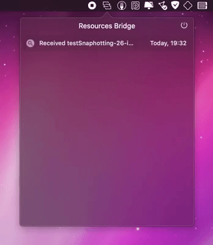

# Resources Bridge

`Resources Bridge` is a tool for sending and requesting files from Mac on iOS devices.
Read and write your Mac's files in a sync manner like they are on your iPhone.

⚠️ Currently this project is in early alfa stage and it's a subject for improvements.

## Requirements

* Swift `5.2`
* iOS `11.0`
* macOS `10.13`

## Install via [SwiftPM](https://swift.org/package-manager/)

```swift
.package(url: "https://github.com/eugenebokhan/ResourcesBridge.git",
         .upToNextMinor(from: "0.0.4"))
```

## How To Use

First of all you need to launch the [`Monitor`](ResourcesBridgeMonitor/) app on your Mac. It is used to receive and send files from iOS devices and handle all local file management.

<p align="left">
    
</p>

After the `Monitor` app is launched, you may call one of the following functions on iPhone or iPad:

* Init Bridge

  ```Swift
  let bridge = try ResourcesBridge()
  ```

* Start session and try to connect to `Monitor` automatically

  ```Swift
  bridge.tryToConnect()
  ```

* Abort connection and stop session

  ```Swift
  bridge.abortConnection()
  ```

* Wait for connection synchronously

  ```Swift
  try bridge.waitForConnection()
  ```

* Write resource on Mac

  ```Swift
  bridge.writeResource(_ resource: Data,
                       at remotePath: String,
                       progressHandler: ((Double) -> Void)? = nil) throws
  ```

  * `progressHandler`: `read` / `write` functions are designed to be synchronous, but you may pass a progress handler that will report progress on other dispatch queue for debug purposes.
  * `remotePath` is an absolute path to the file on Mac.

* Read resource from Mac

  The logic is similar to the `write` func.

  ```Swift
  bridge.readResource(at remotePath: String,
                      progressHandler: ((Double) -> Void)? = nil) throws -> Data
  ```

# Dependencies

This project is based on [`Bonjour`](https://github.com/eugenebokhan/Bonjour) framework. You can use it for async communication and files transferring between 🍏 devices.

# [License](LICENSE)

MIT
